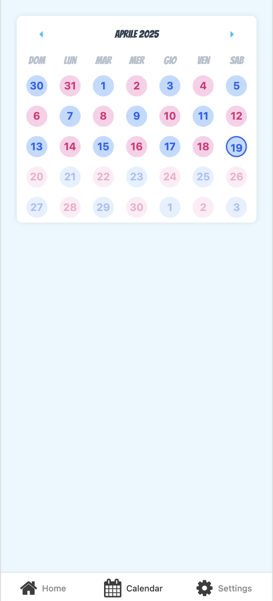
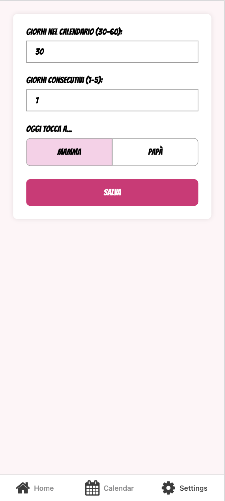

# Bedtime Routine

A simple and colorful mobile application built with Expo to (hopefully!) help parents with their children bedtime routines.

## Screenshots

<p>
   
   
   
</p>

## Installation

1. Clone the repository:
   ```
   git clone https://github.com/yourusername/bedtime-routine.git
   cd bedtime-routine
   ```

2. Install dependencies:
   ```
   npm install
   ```

3. Start the development server:
   ```
   npx expo start
   ```

### Build Configurations

To create a build:
```
eas build --profile <profile-name> --platform <ios|android>
```

If you want to build locally, add the `--local` flag.

## Third-Party Libraries and AI

This app leverages the following Open Source projects:
* [Expo and EAS](https://docs.expo.dev/)
* [React Native Calendars](https://github.com/wix/react-native-calendars)
* [React Native Nice Avatars](https://github.com/zamplyy/react-native-nice-avatar)
* [Async Storage](https://github.com/react-native-async-storage/async-storage)

The UI design was inspired by experimentation with [v0](https://v0.dev/).  
The logo and the splash screen have been created with [ChatGPT](https://chatgpt.com/).

## Contributing

Contributions are welcome! Please feel free to submit a Pull Request.

## License

This project is licensed under the MIT License - see the [LICENSE](LICENSE) file for details.
